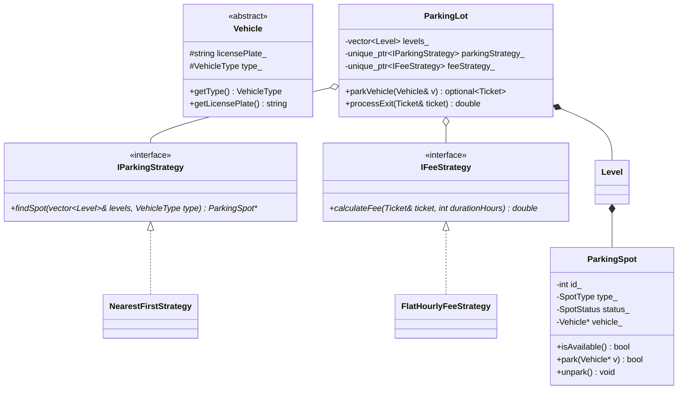

# 04. UML Class & Sequence Diagrams

```mermaid
classDiagram
    class Vehicle {
        <<abstract>>
        #string licensePlate_
        #VehicleType type_
        +getType() VehicleType
        +getLicensePlate() string
    }

    class ParkingSpot {
        -int id_
        -SpotType type_
        -SpotStatus status_
        -Vehicle* vehicle_
        +isAvailable() bool
        +park(Vehicle* v) bool
        +unpark() void
    }

    class IParkingStrategy {
        <<interface>>
        +findSpot(vector~Level~& levels, VehicleType type)* ParkingSpot*
    }

    class IFeeStrategy {
        <<interface>>
        +calculateFee(Ticket& ticket, int durationHours)* double
    }

    class ParkingLot {
        -vector~Level~ levels_
        -unique_ptr~IParkingStrategy~ parkingStrategy_
        -unique_ptr~IFeeStrategy~ feeStrategy_
        +parkVehicle(Vehicle& v) optional~Ticket~
        +processExit(Ticket& ticket) double
    }

    IParkingStrategy <|.. NearestFirstStrategy
    IFeeStrategy <|.. FlatHourlyFeeStrategy
    ParkingLot o-- IParkingStrategy
    ParkingLot o-- IFeeStrategy
    ParkingLot *-- Level
    Level *-- ParkingSpot
```
